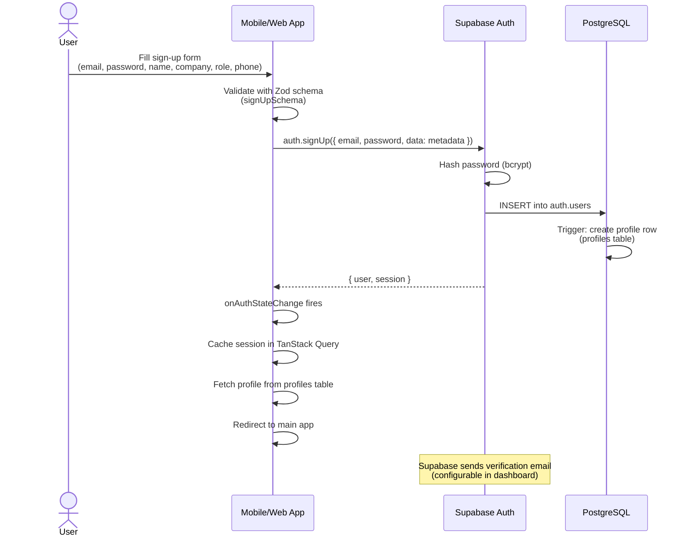
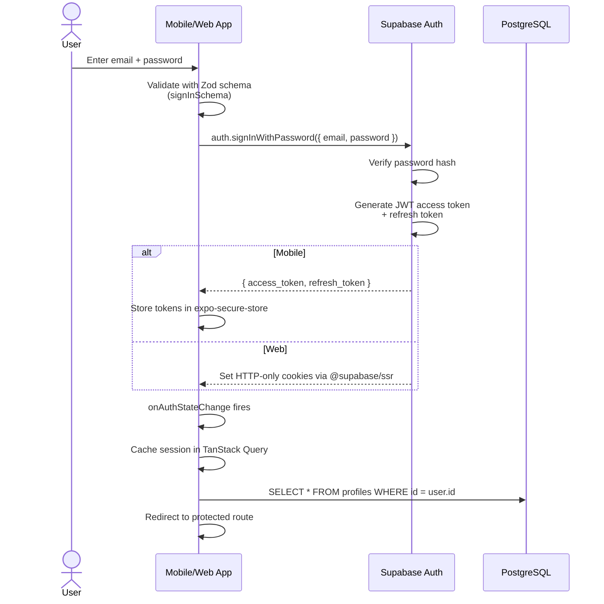
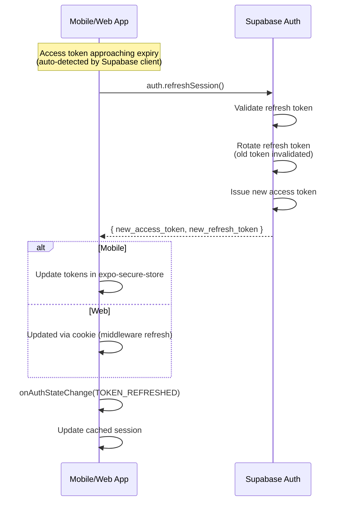
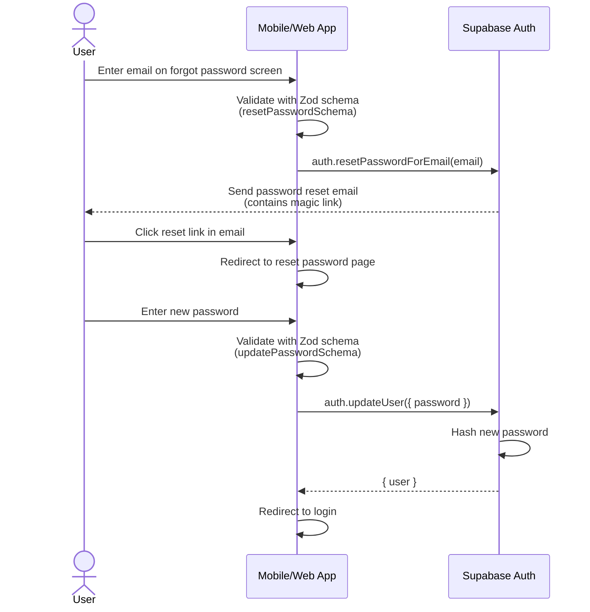
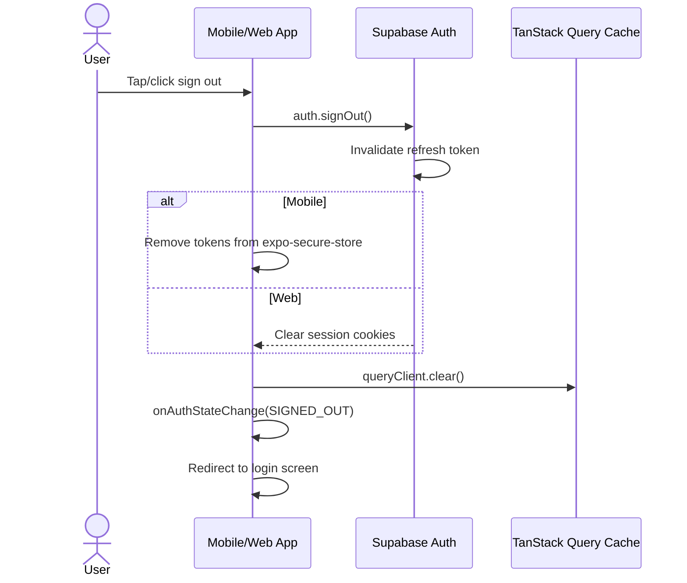

# Tabadul — Authentication Flow

> **Status:** Approved  
> **Last Updated:** 2026-04-05  
> **SOP:** SOP-203 (Authentication)

---

## 1. Auth Strategy

**Provider:** Supabase Auth  
**Method:** Email + Password (JWT)  
**Decision Source:** `/docs/tech-stack.md` §2.3, §5 (Feature-to-Technology Mapping)

Supabase Auth handles all authentication concerns:
- User registration and login
- Password hashing (bcrypt, managed by Supabase)
- JWT token issuance and refresh
- Email verification and password reset flows
- Session management (cookies for web, secure storage for mobile)

No custom auth endpoints are needed — Supabase Auth provides all required functionality.

---

## 2. Token Configuration

| Parameter | Value | Notes |
|-----------|-------|-------|
| **Access Token Lifetime** | 3600s (1 hour) | Supabase default; auto-refreshed by client |
| **Refresh Token Lifetime** | 7 days | Configurable in Supabase dashboard |
| **Token Type** | JWT (HS256) | Signed by Supabase JWT secret |
| **Token Storage (Mobile)** | expo-secure-store | Encrypted keychain/keystore |
| **Token Storage (Web)** | HTTP-only cookies | Managed by `@supabase/ssr` |
| **Session Persistence** | Yes | Auto-restored on app launch |
| **Auto-Refresh** | Yes | Client refreshes before expiry |

---

## 3. Authentication Flows

### 3.1 Sign-Up Flow



### 3.2 Sign-In Flow



### 3.3 Token Refresh Flow



### 3.4 Password Reset Flow



### 3.5 Sign-Out Flow



---

## 4. Route Protection Architecture

### 4.1 Mobile (Expo Router)

```
_layout.tsx (Root)
├── QueryClientProvider
└── AuthGuard
    ├── Checks useAuth().isAuthenticated
    ├── Checks current route segment
    ├── If NOT authenticated & NOT in (auth) → redirect to /(auth)/login
    └── If authenticated & IN (auth) → redirect to /(tabs)
        │
        ├── (auth)/_layout.tsx          ← Public routes (no header)
        │   ├── login.tsx
        │   ├── register.tsx
        │   └── forgot-password.tsx
        │
        └── (tabs)/_layout.tsx          ← Protected routes (tab bar)
            ├── index.tsx (Home)
            ├── marketplace.tsx
            ├── chat.tsx
            └── profile.tsx
```

### 4.2 Web (Next.js)

```
middleware.ts (Edge)
├── Locale detection → redirect to /ar/... or /en/...
├── Session refresh → supabase.auth.getUser()
├── Auth check:
│   ├── Protected route + no user → redirect to /{locale}/login
│   ├── Auth route + user → redirect to /{locale}/marketplace
│   └── Admin route + non-admin → redirect to /{locale}/marketplace
│
app/[locale]/
├── (auth)/layout.tsx                ← Public routes (centered form)
│   ├── login/page.tsx
│   ├── register/page.tsx
│   └── forgot-password/page.tsx
│
├── (main)/layout.tsx                ← Protected (server-side auth check)
│   ├── marketplace/page.tsx
│   ├── transactions/page.tsx
│   ├── chat/page.tsx
│   └── profile/page.tsx
│
└── admin/layout.tsx                 ← Admin-only (role-gated)
    ├── transactions/page.tsx
    └── users/page.tsx
```

### 4.3 Defense-in-Depth Model

| Layer | Platform | Mechanism | Purpose |
|-------|----------|-----------|---------|
| **1. Middleware** | Web | `middleware.ts` | Redirect before page renders |
| **1. Auth Guard** | Mobile | Root `_layout.tsx` | Redirect before screen renders |
| **2. Server Layout** | Web | `(main)/layout.tsx` | Server-side auth check (RSC) |
| **3. RLS Policies** | Both | PostgreSQL RLS | Row-level data access control |
| **4. Edge Functions** | Both | Deno Edge Functions | Business rule enforcement |

---

## 5. Security Considerations

### 5.1 Token Security

- **Mobile:** Tokens stored in `expo-secure-store` (iOS Keychain / Android Keystore). Never in AsyncStorage or MMKV.
- **Web:** Tokens managed as HTTP-only cookies by `@supabase/ssr`. Never accessible via JavaScript (`document.cookie` cannot read them).
- **Middleware:** Uses `supabase.auth.getUser()` (server-validates token) instead of `getSession()` (reads cookie without validation). This prevents token forgery.

### 5.2 Password Security

- Passwords are hashed server-side by Supabase Auth using bcrypt.
- Minimum 8 characters, must contain uppercase, lowercase, and number.
- Password reset requires email verification (magic link).
- Old refresh tokens are invalidated on password change.

### 5.3 Session Security

- Refresh tokens are rotated on each use (one-time use).
- Sessions expire after 7 days of inactivity.
- Sign-out invalidates refresh token server-side.
- `queryClient.clear()` wipes all cached data on sign-out.

### 5.4 CSRF Protection

- Web: Supabase SSR uses `SameSite=Lax` cookies by default.
- Next.js middleware validates the session on every request.
- No custom session cookies are used — Supabase manages cookie security.

### 5.5 Rate Limiting

- Supabase Auth has built-in rate limiting for auth endpoints.
- Default: 30 sign-in attempts per hour per IP.
- Configurable in Supabase dashboard under Auth → Rate Limits.

---

## 6. Implementation Files

| File | Platform | Purpose |
|------|----------|---------|
| `packages/shared/src/schemas/auth.ts` | Shared | Zod validation schemas (signIn, signUp, profile, password) |
| `packages/shared/src/types/auth.ts` | Shared | TypeScript types (Profile, AuthUser, AuthState, AuthActions) |
| `apps/mobile/src/lib/supabase.ts` | Mobile | Supabase client with expo-secure-store adapter |
| `apps/web/src/lib/supabase.ts` | Web | Browser Supabase client (@supabase/ssr) |
| `apps/web/src/lib/supabaseServer.ts` | Web | Server Supabase client (RSC, Route Handlers) |
| `apps/mobile/src/hooks/useAuth.ts` | Mobile | Auth hook (session, profile, actions) |
| `apps/web/src/hooks/useAuth.ts` | Web | Auth hook (session, profile, actions) |
| `apps/mobile/src/lib/queryKeys.ts` | Mobile | Query key factory (auth, listings, etc.) |
| `apps/web/src/lib/queryKeys.ts` | Web | Query key factory (auth, listings, etc.) |
| `apps/mobile/src/app/_layout.tsx` | Mobile | Root layout with AuthGuard + QueryClientProvider |
| `apps/mobile/src/app/(auth)/_layout.tsx` | Mobile | Auth route group layout |
| `apps/mobile/src/app/(tabs)/_layout.tsx` | Mobile | Protected tabs layout |
| `apps/web/src/middleware.ts` | Web | Locale detection + session refresh + auth protection |
| `apps/web/src/app/[locale]/(auth)/layout.tsx` | Web | Auth pages layout |
| `apps/web/src/app/[locale]/(main)/layout.tsx` | Web | Protected pages layout (server-side check) |

---

## 7. Review Checklist

- [x] Auth strategy matches tech stack choice (Supabase Auth)
- [x] Tokens/sessions issued on successful login (managed by Supabase)
- [x] Passwords hashed (bcrypt — managed by Supabase Auth)
- [x] Auth middleware protects all private routes (mobile: AuthGuard, web: middleware.ts)
- [x] `401` equivalent for missing/invalid tokens (redirect to login)
- [x] Refresh token rotation implemented (Supabase default behavior)
- [x] Auth flow documented (this document)

---

## 8. Related Documents

| Document | Location |
|----------|----------|
| Tech Stack | `/docs/tech-stack.md` |
| Design Patterns (§3.8 Auth) | `/docs/architecture/design-patterns.md` |
| Database Schema (profiles) | `/docs/database/schema.md` |
| Authorization (SOP-204) | `.sops/phase-2-api-backend/SOP-204-authorization.md` |
