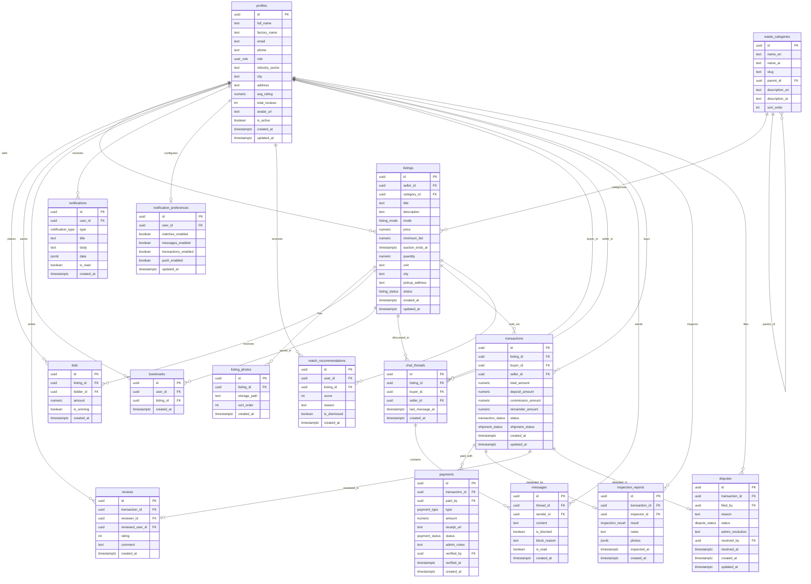

# Tabadul — Database Schema

> **Status:** Approved
> **Last Updated:** 2026-03-13
> **SOP:** SOP-101 (Schema Design)

---

## 1. ER Diagram

---

## 2. Enum Definitions

| Enum                 | Values                                                                                                                                                                                             | Used By                        |
| -------------------- | -------------------------------------------------------------------------------------------------------------------------------------------------------------------------------------------------- | ------------------------------ |
| `user_role`          | `buyer`, `seller`, `admin`, `inspector`                                                                                                                                                            | `profiles.role`                |
| `listing_status`     | `draft`, `active`, `sold`, `deactivated`                                                                                                                                                           | `listings.status`              |
| `listing_mode`       | `fixed_price`, `auction`                                                                                                                                                                           | `listings.mode`                |
| `transaction_status` | `pending_deposit`, `deposit_paid`, `deposit_verified`, `inspection_scheduled`, `inspection_passed`, `inspection_failed`, `shipping`, `delivered`, `approved`, `disputed`, `completed`, `cancelled` | `transactions.status`          |
| `payment_type`       | `deposit`, `remainder`                                                                                                                                                                             | `payments.type`                |
| `payment_status`     | `pending`, `uploaded`, `verified`, `rejected`                                                                                                                                                      | `payments.status`              |
| `inspection_result`  | `pass`, `fail`                                                                                                                                                                                     | `inspection_reports.result`    |
| `shipment_status`    | `pending`, `scheduled`, `picked_up`, `in_transit`, `delivered`                                                                                                                                     | `transactions.shipment_status` |
| `dispute_status`     | `open`, `under_review`, `resolved_buyer`, `resolved_seller`                                                                                                                                        | `disputes.status`              |
| `notification_type`  | `match`, `message`, `transaction`, `system`                                                                                                                                                        | `notifications.type`           |

---

## 3. Table Definitions

### 3.1 `profiles`

Extends Supabase `auth.users`. One row per registered user; `id` references `auth.users(id)`.

| Column            | Type           | Constraints                 | Description                      |
| ----------------- | -------------- | --------------------------- | -------------------------------- |
| `id`              | `uuid`         | PK, FK → `auth.users(id)`   | Matches Supabase Auth user ID    |
| `full_name`       | `text`         | NOT NULL                    | Contact person name              |
| `factory_name`    | `text`         | NOT NULL                    | Registered factory name          |
| `email`           | `text`         | NOT NULL, UNIQUE            | Login email (mirrored from auth) |
| `phone`           | `text`         |                             | Phone number                     |
| `role`            | `user_role`    | NOT NULL, DEFAULT `'buyer'` | Primary platform role            |
| `industry_sector` | `text`         |                             | e.g., "Textiles", "Plastics"     |
| `city`            | `text`         |                             | City within Suez Canal Zone      |
| `address`         | `text`         |                             | Full address for logistics       |
| `avatar_url`      | `text`         |                             | Profile image storage path       |
| `avg_rating`      | `numeric(2,1)` | DEFAULT `0`                 | Cached average review rating     |
| `total_reviews`   | `integer`      | DEFAULT `0`                 | Cached review count              |
| `is_active`       | `boolean`      | DEFAULT `true`              | Admin can suspend/ban            |
| `created_at`      | `timestamptz`  | DEFAULT `now()`             |                                  |
| `updated_at`      | `timestamptz`  | DEFAULT `now()`             |                                  |

---

### 3.2 `waste_categories`

Taxonomy of industrial waste types (~13 top-level categories, inspired by MRKOON). Supports one level of sub-categories via self-referencing `parent_id`.

| Column           | Type      | Constraints                     | Description                   |
| ---------------- | --------- | ------------------------------- | ----------------------------- |
| `id`             | `uuid`    | PK, DEFAULT `gen_random_uuid()` |                               |
| `name_en`        | `text`    | NOT NULL                        | English category name         |
| `name_ar`        | `text`    | NOT NULL                        | Arabic category name          |
| `slug`           | `text`    | NOT NULL, UNIQUE                | URL-safe identifier           |
| `parent_id`      | `uuid`    | FK → `waste_categories(id)`     | NULL for top-level categories |
| `description_en` | `text`    |                                 | English description           |
| `description_ar` | `text`    |                                 | Arabic description            |
| `sort_order`     | `integer` | DEFAULT `0`                     | Display ordering              |

---

### 3.3 `listings`

Waste material listings created by sellers. Support both fixed-price and auction modes.

| Column            | Type             | Constraints                           | Description                              |
| ----------------- | ---------------- | ------------------------------------- | ---------------------------------------- |
| `id`              | `uuid`           | PK, DEFAULT `gen_random_uuid()`       |                                          |
| `seller_id`       | `uuid`           | NOT NULL, FK → `profiles(id)`         | Listing creator                          |
| `category_id`     | `uuid`           | NOT NULL, FK → `waste_categories(id)` | Waste type                               |
| `title`           | `text`           | NOT NULL                              | Listing title                            |
| `description`     | `text`           |                                       | Detailed description                     |
| `mode`            | `listing_mode`   | NOT NULL                              | `fixed_price` or `auction`               |
| `price`           | `numeric(12,2)`  |                                       | Fixed price (EGP); NULL for auction      |
| `minimum_bid`     | `numeric(12,2)`  |                                       | Starting bid for auction; NULL for fixed |
| `auction_ends_at` | `timestamptz`    |                                       | Auction end time; NULL for fixed         |
| `quantity`        | `numeric(12,2)`  | NOT NULL                              | Amount available                         |
| `unit`            | `text`           | NOT NULL                              | Unit of measure (kg, ton, m³, etc.)      |
| `city`            | `text`           | NOT NULL                              | Pickup city                              |
| `pickup_address`  | `text`           |                                       | Full pickup address                      |
| `status`          | `listing_status` | NOT NULL, DEFAULT `'active'`          | Listing lifecycle state                  |
| `created_at`      | `timestamptz`    | DEFAULT `now()`                       |                                          |
| `updated_at`      | `timestamptz`    | DEFAULT `now()`                       |                                          |

---

### 3.4 `listing_photos`

Photos attached to listings for quality assessment (US-012).

| Column         | Type          | Constraints                                     | Description           |
| -------------- | ------------- | ----------------------------------------------- | --------------------- |
| `id`           | `uuid`        | PK, DEFAULT `gen_random_uuid()`                 |                       |
| `listing_id`   | `uuid`        | NOT NULL, FK → `listings(id)` ON DELETE CASCADE |                       |
| `storage_path` | `text`        | NOT NULL                                        | Supabase Storage path |
| `sort_order`   | `integer`     | DEFAULT `0`                                     | Display order         |
| `created_at`   | `timestamptz` | DEFAULT `now()`                                 |                       |

---

### 3.5 `bids`

Auction bids placed by buyers (US-011, US-050).

| Column       | Type            | Constraints                                     | Description             |
| ------------ | --------------- | ----------------------------------------------- | ----------------------- |
| `id`         | `uuid`          | PK, DEFAULT `gen_random_uuid()`                 |                         |
| `listing_id` | `uuid`          | NOT NULL, FK → `listings(id)` ON DELETE CASCADE |                         |
| `bidder_id`  | `uuid`          | NOT NULL, FK → `profiles(id)`                   |                         |
| `amount`     | `numeric(12,2)` | NOT NULL                                        | Bid amount in EGP       |
| `is_winning` | `boolean`       | DEFAULT `false`                                 | Set when auction closes |
| `created_at` | `timestamptz`   | DEFAULT `now()`                                 |                         |

---

### 3.6 `bookmarks`

Saved/bookmarked listings (US-023).

| Column       | Type          | Constraints                                     | Description |
| ------------ | ------------- | ----------------------------------------------- | ----------- |
| `id`         | `uuid`        | PK, DEFAULT `gen_random_uuid()`                 |             |
| `user_id`    | `uuid`        | NOT NULL, FK → `profiles(id)` ON DELETE CASCADE |             |
| `listing_id` | `uuid`        | NOT NULL, FK → `listings(id)` ON DELETE CASCADE |             |
| `created_at` | `timestamptz` | DEFAULT `now()`                                 |             |

**Unique:** `(user_id, listing_id)` — prevent duplicate bookmarks.

---

### 3.7 `chat_threads`

Per-listing conversations between buyer and seller (US-040).

| Column            | Type          | Constraints                     | Description          |
| ----------------- | ------------- | ------------------------------- | -------------------- |
| `id`              | `uuid`        | PK, DEFAULT `gen_random_uuid()` |                      |
| `listing_id`      | `uuid`        | NOT NULL, FK → `listings(id)`   |                      |
| `buyer_id`        | `uuid`        | NOT NULL, FK → `profiles(id)`   | Thread initiator     |
| `seller_id`       | `uuid`        | NOT NULL, FK → `profiles(id)`   | Listing owner        |
| `last_message_at` | `timestamptz` |                                 | For ordering threads |
| `created_at`      | `timestamptz` | DEFAULT `now()`                 |                      |

**Unique:** `(listing_id, buyer_id)` — one thread per buyer per listing.

---

### 3.8 `messages`

Individual messages within a chat thread (US-040–042).

| Column         | Type          | Constraints                                         | Description                           |
| -------------- | ------------- | --------------------------------------------------- | ------------------------------------- |
| `id`           | `uuid`        | PK, DEFAULT `gen_random_uuid()`                     |                                       |
| `thread_id`    | `uuid`        | NOT NULL, FK → `chat_threads(id)` ON DELETE CASCADE |                                       |
| `sender_id`    | `uuid`        | NOT NULL, FK → `profiles(id)`                       |                                       |
| `content`      | `text`        | NOT NULL                                            | Message body                          |
| `is_blocked`   | `boolean`     | DEFAULT `false`                                     | Blocked by moderation filter          |
| `block_reason` | `text`        |                                                     | Why blocked (phone, email, profanity) |
| `is_read`      | `boolean`     | DEFAULT `false`                                     | Read receipt                          |
| `created_at`   | `timestamptz` | DEFAULT `now()`                                     |                                       |

---

### 3.9 `transactions`

Complete transaction lifecycle (US-050–055). Central entity connecting buyer, seller, and listing.

| Column              | Type                 | Constraints                           | Description             |
| ------------------- | -------------------- | ------------------------------------- | ----------------------- |
| `id`                | `uuid`               | PK, DEFAULT `gen_random_uuid()`       |                         |
| `listing_id`        | `uuid`               | NOT NULL, FK → `listings(id)`         |                         |
| `buyer_id`          | `uuid`               | NOT NULL, FK → `profiles(id)`         |                         |
| `seller_id`         | `uuid`               | NOT NULL, FK → `profiles(id)`         |                         |
| `total_amount`      | `numeric(12,2)`      | NOT NULL                              | Agreed price in EGP     |
| `deposit_amount`    | `numeric(12,2)`      | NOT NULL                              | Upfront deposit portion |
| `commission_amount` | `numeric(12,2)`      |                                       | Platform commission     |
| `remainder_amount`  | `numeric(12,2)`      |                                       | `total - deposit`       |
| `status`            | `transaction_status` | NOT NULL, DEFAULT `'pending_deposit'` | Lifecycle state         |
| `shipment_status`   | `shipment_status`    | DEFAULT `'pending'`                   | Logistics tracking      |
| `created_at`        | `timestamptz`        | DEFAULT `now()`                       |                         |
| `updated_at`        | `timestamptz`        | DEFAULT `now()`                       |                         |

---

### 3.10 `payments`

InstaPay payment records with receipt uploads (US-051–053).

| Column           | Type             | Constraints                       | Description                      |
| ---------------- | ---------------- | --------------------------------- | -------------------------------- |
| `id`             | `uuid`           | PK, DEFAULT `gen_random_uuid()`   |                                  |
| `transaction_id` | `uuid`           | NOT NULL, FK → `transactions(id)` |                                  |
| `paid_by`        | `uuid`           | NOT NULL, FK → `profiles(id)`     | Buyer                            |
| `type`           | `payment_type`   | NOT NULL                          | `deposit` or `remainder`         |
| `amount`         | `numeric(12,2)`  | NOT NULL                          | Payment amount in EGP            |
| `receipt_url`    | `text`           |                                   | InstaPay receipt screenshot path |
| `status`         | `payment_status` | NOT NULL, DEFAULT `'pending'`     | Verification state               |
| `admin_notes`    | `text`           |                                   | Admin remarks on verification    |
| `verified_by`    | `uuid`           | FK → `profiles(id)`               | Admin who verified               |
| `verified_at`    | `timestamptz`    |                                   | When verified                    |
| `created_at`     | `timestamptz`    | DEFAULT `now()`                   |                                  |

---

### 3.11 `inspection_reports`

Middleman inspector verification (US-062).

| Column           | Type                | Constraints                               | Description              |
| ---------------- | ------------------- | ----------------------------------------- | ------------------------ |
| `id`             | `uuid`              | PK, DEFAULT `gen_random_uuid()`           |                          |
| `transaction_id` | `uuid`              | NOT NULL, UNIQUE, FK → `transactions(id)` | One report per txn       |
| `inspector_id`   | `uuid`              | NOT NULL, FK → `profiles(id)`             | Inspector user           |
| `result`         | `inspection_result` | NOT NULL                                  | `pass` or `fail`         |
| `notes`          | `text`              |                                           | Inspector observations   |
| `photos`         | `jsonb`             | DEFAULT `'[]'`                            | Array of storage paths   |
| `inspected_at`   | `timestamptz`       | NOT NULL                                  | When inspection occurred |
| `created_at`     | `timestamptz`       | DEFAULT `now()`                           |                          |

---

### 3.12 `reviews`

Buyer-to-seller ratings post-transaction (US-061, US-063).

| Column             | Type          | Constraints                               | Description        |
| ------------------ | ------------- | ----------------------------------------- | ------------------ |
| `id`               | `uuid`        | PK, DEFAULT `gen_random_uuid()`           |                    |
| `transaction_id`   | `uuid`        | NOT NULL, UNIQUE, FK → `transactions(id)` | One review per txn |
| `reviewer_id`      | `uuid`        | NOT NULL, FK → `profiles(id)`             | Buyer              |
| `reviewed_user_id` | `uuid`        | NOT NULL, FK → `profiles(id)`             | Seller being rated |
| `rating`           | `integer`     | NOT NULL, CHECK `1–5`                     | Star rating        |
| `comment`          | `text`        |                                           | Review text        |
| `created_at`       | `timestamptz` | DEFAULT `now()`                           |                    |

---

### 3.13 `notifications`

In-app and push notifications (US-090).

| Column       | Type                | Constraints                                     | Description                        |
| ------------ | ------------------- | ----------------------------------------------- | ---------------------------------- |
| `id`         | `uuid`              | PK, DEFAULT `gen_random_uuid()`                 |                                    |
| `user_id`    | `uuid`              | NOT NULL, FK → `profiles(id)` ON DELETE CASCADE | Recipient                          |
| `type`       | `notification_type` | NOT NULL                                        | Category                           |
| `title`      | `text`              | NOT NULL                                        | Notification title                 |
| `body`       | `text`              | NOT NULL                                        | Notification body                  |
| `data`       | `jsonb`             | DEFAULT `'{}'`                                  | Payload (listing_id, txn_id, etc.) |
| `is_read`    | `boolean`           | DEFAULT `false`                                 |                                    |
| `created_at` | `timestamptz`       | DEFAULT `now()`                                 |                                    |

---

### 3.14 `notification_preferences`

Per-user notification category toggles (US-091).

| Column                 | Type          | Constraints                                             | Description               |
| ---------------------- | ------------- | ------------------------------------------------------- | ------------------------- |
| `id`                   | `uuid`        | PK, DEFAULT `gen_random_uuid()`                         |                           |
| `user_id`              | `uuid`        | NOT NULL, UNIQUE, FK → `profiles(id)` ON DELETE CASCADE | One row per user          |
| `matches_enabled`      | `boolean`     | DEFAULT `true`                                          | Match alerts              |
| `messages_enabled`     | `boolean`     | DEFAULT `true`                                          | Chat message alerts       |
| `transactions_enabled` | `boolean`     | DEFAULT `true`                                          | Transaction status alerts |
| `push_enabled`         | `boolean`     | DEFAULT `true`                                          | Master push toggle        |
| `updated_at`           | `timestamptz` | DEFAULT `now()`                                         |                           |

---

### 3.15 `disputes`

Transaction disputes filed by buyers (US-054, US-084).

| Column             | Type             | Constraints                               | Description         |
| ------------------ | ---------------- | ----------------------------------------- | ------------------- |
| `id`               | `uuid`           | PK, DEFAULT `gen_random_uuid()`           |                     |
| `transaction_id`   | `uuid`           | NOT NULL, UNIQUE, FK → `transactions(id)` | One dispute per txn |
| `filed_by`         | `uuid`           | NOT NULL, FK → `profiles(id)`             | Buyer               |
| `reason`           | `text`           | NOT NULL                                  | Dispute description |
| `status`           | `dispute_status` | NOT NULL, DEFAULT `'open'`                | Resolution state    |
| `admin_resolution` | `text`           |                                           | Admin's ruling      |
| `resolved_by`      | `uuid`           | FK → `profiles(id)`                       | Admin who resolved  |
| `resolved_at`      | `timestamptz`    |                                           | When resolved       |
| `created_at`       | `timestamptz`    | DEFAULT `now()`                           |                     |
| `updated_at`       | `timestamptz`    | DEFAULT `now()`                           |                     |

---

### 3.16 `match_recommendations`

AI-generated match results with compatibility scores (US-030–032).

| Column         | Type          | Constraints                                     | Description                        |
| -------------- | ------------- | ----------------------------------------------- | ---------------------------------- |
| `id`           | `uuid`        | PK, DEFAULT `gen_random_uuid()`                 |                                    |
| `user_id`      | `uuid`        | NOT NULL, FK → `profiles(id)` ON DELETE CASCADE | Recommended to                     |
| `listing_id`   | `uuid`        | NOT NULL, FK → `listings(id)` ON DELETE CASCADE | Recommended listing                |
| `score`        | `integer`     | NOT NULL, CHECK `0–100`                         | Compatibility %                    |
| `reason`       | `text`        |                                                 | e.g., "Same waste type, 15km away" |
| `is_dismissed` | `boolean`     | DEFAULT `false`                                 | User dismissed recommendation      |
| `created_at`   | `timestamptz` | DEFAULT `now()`                                 |                                    |

**Unique:** `(user_id, listing_id)` — one recommendation per user per listing.

---

## 4. Indexes

| Table                   | Index Name                       | Columns            | Purpose                    |
| ----------------------- | -------------------------------- | ------------------ | -------------------------- |
| `profiles`              | `idx_profiles_role`              | `role`             | Filter users by role       |
| `profiles`              | `idx_profiles_city`              | `city`             | Geographic filtering       |
| `profiles`              | `idx_profiles_is_active`         | `is_active`        | Active user queries        |
| `waste_categories`      | `idx_waste_categories_parent_id` | `parent_id`        | Sub-category lookup        |
| `listings`              | `idx_listings_seller_id`         | `seller_id`        | Seller's listings          |
| `listings`              | `idx_listings_category_id`       | `category_id`      | Filter by waste type       |
| `listings`              | `idx_listings_status`            | `status`           | Active listings query      |
| `listings`              | `idx_listings_mode`              | `mode`             | Filter by sale mode        |
| `listings`              | `idx_listings_city`              | `city`             | Geographic filtering       |
| `listings`              | `idx_listings_created_at`        | `created_at DESC`  | Recent listings            |
| `listing_photos`        | `idx_listing_photos_listing_id`  | `listing_id`       | Photos for listing         |
| `bids`                  | `idx_bids_listing_id`            | `listing_id`       | Bids on listing            |
| `bids`                  | `idx_bids_bidder_id`             | `bidder_id`        | User's bid history         |
| `bookmarks`             | `idx_bookmarks_user_id`          | `user_id`          | User's saved listings      |
| `chat_threads`          | `idx_chat_threads_listing_id`    | `listing_id`       | Threads for listing        |
| `chat_threads`          | `idx_chat_threads_buyer_id`      | `buyer_id`         | Buyer's threads            |
| `chat_threads`          | `idx_chat_threads_seller_id`     | `seller_id`        | Seller's threads           |
| `messages`              | `idx_messages_thread_id`         | `thread_id`        | Messages in thread         |
| `messages`              | `idx_messages_sender_id`         | `sender_id`        | User's messages            |
| `transactions`          | `idx_transactions_listing_id`    | `listing_id`       | Transactions for listing   |
| `transactions`          | `idx_transactions_buyer_id`      | `buyer_id`         | Buyer's transactions       |
| `transactions`          | `idx_transactions_seller_id`     | `seller_id`        | Seller's transactions      |
| `transactions`          | `idx_transactions_status`        | `status`           | Filter by txn status       |
| `payments`              | `idx_payments_transaction_id`    | `transaction_id`   | Payments for transaction   |
| `payments`              | `idx_payments_status`            | `status`           | Pending verification queue |
| `notifications`         | `idx_notifications_user_id`      | `user_id`          | User's notifications       |
| `notifications`         | `idx_notifications_is_read`      | `user_id, is_read` | Unread notification count  |
| `match_recommendations` | `idx_match_recs_user_id`         | `user_id`          | User's recommendations     |
| `disputes`              | `idx_disputes_status`            | `status`           | Open disputes queue        |

---

## 5. Normalization Notes

### 1NF Compliance

- No repeating groups: photos are in a separate `listing_photos` table (not comma-separated), inspection photos use JSONB array (atomic within PostgreSQL's type system).
- Every cell contains a single value.

### 2NF Compliance

- All tables use single-column surrogate PKs (`uuid`), so all non-key columns depend on the full PK by definition.

### 3NF Compliance

- `avg_rating` and `total_reviews` on `profiles` are denormalized (derived from `reviews`). This is an intentional trade-off — these are read-heavy fields (shown on every listing card) that would otherwise require a join + aggregate on every listing page load. They are updated via a database trigger on `reviews` insert.

---

## 6. Design Decisions

| Decision                                              | Rationale                                                                        |
| ----------------------------------------------------- | -------------------------------------------------------------------------------- |
| UUIDs over auto-increment                             | Required for Supabase Auth integration; safe for distributed systems             |
| `profiles` references `auth.users(id)`                | Standard Supabase pattern — Auth manages credentials, `profiles` stores app data |
| `timestamptz` for all timestamps                      | Timezone-aware; critical for auction end times across time zones                 |
| `numeric(12,2)` for monetary fields                   | Exact decimal arithmetic for EGP amounts; avoids floating-point rounding         |
| Cascade deletes on photos/bookmarks/notifications     | Orphaned records add no value; parent deletion should clean up                   |
| No cascade on transactions/reviews                    | Financial records must be preserved even if listing is deactivated               |
| `shipment_status` on `transactions`                   | Avoids a separate `shipments` table for MVP; can be extracted later              |
| Bilingual columns (`name_en`/`name_ar`) on categories | Static reference data — simpler than a join to a translations table              |
| JSONB for inspection photos                           | Small array of storage paths; doesn't warrant a separate table                   |
