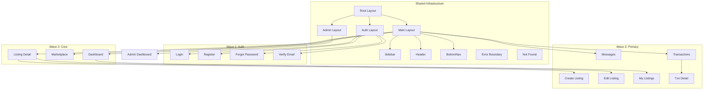

# Page Manifest — SOP-305

> **SOP:** SOP-305 · Page Implementation
> **Phase:** 3 (Frontend — Web First)
> **Prerequisites:** SOP-300 ✅, SOP-301 ✅, SOP-302 ✅, SOP-303 ✅, SOP-304 ✅
> **Created:** 2026-05-16

---

## 1. Route Structure Overview

```
app/[locale]/
├── (auth)/                          ← Public auth pages (no sidebar/nav)
│   ├── login/page.tsx
│   ├── register/page.tsx
│   ├── forgot-password/page.tsx
│   └── verify-email/page.tsx
├── (main)/                          ← Protected pages (sidebar + header)
│   ├── dashboard/page.tsx
│   ├── marketplace/page.tsx
│   ├── marketplace/[id]/page.tsx
│   ├── listings/new/page.tsx
│   ├── listings/[id]/edit/page.tsx
│   ├── listings/my/page.tsx
│   ├── messages/page.tsx
│   ├── messages/[threadId]/page.tsx
│   ├── transactions/page.tsx
│   ├── transactions/[id]/page.tsx
│   ├── saved/page.tsx
│   ├── recommendations/page.tsx
│   ├── notifications/page.tsx
│   ├── notifications/preferences/page.tsx
│   ├── profile/page.tsx
│   ├── profile/edit/page.tsx
│   └── profile/[userId]/page.tsx     ← Seller public profile
└── admin/                           ← Admin panel (separate layout)
    ├── dashboard/page.tsx
    ├── users/page.tsx
    ├── listings/page.tsx
    ├── payments/page.tsx
    ├── disputes/page.tsx
    └── disputes/[id]/page.tsx
```

---

## 2. Page Manifest Table

### Priority Legend

| Priority | Meaning | Rationale |
|----------|---------|-----------|
| **P0** | Critical | Core user flows — login, dashboard, marketplace |
| **P1** | High | Primary feature pages — chat, transactions, listings CRUD |
| **P2** | Medium | Secondary features — notifications, profile, reviews |
| **P3** | Lower | Admin panel, edge-case pages |

---

### Auth Pages (Route Group: `(auth)`)

| # | Page | Route | API Endpoints | Key Components | Forms (SOP-304) | Design Spec | Priority | Status |
|---|------|-------|---------------|----------------|------------------|-------------|----------|--------|
| 1 | Login | `/(auth)/login` | `signIn` (useAuth) | AuthCard, Input, Button, ErrorBanner | `SignInForm` | auth-profile §2.1 | P0 | ⬚ |
| 2 | Register | `/(auth)/register` | `signUp` (useAuth) | AuthCard, Input, Button, PasswordStrength | `SignUpForm` | auth-profile §2.2 | P0 | ⬚ |
| 3 | Forgot Password | `/(auth)/forgot-password` | `resetPassword` (useAuth) | AuthCard, Input, Button | `ResetPasswordForm` | auth-profile §2.4 | P1 | ⬚ |
| 4 | Email Verification | `/(auth)/verify-email` | — (static) | AuthCard, Button | — | auth-profile §2.3 | P1 | ⬚ |

---

### Main Pages (Route Group: `(main)` — Protected)

| # | Page | Route | API Endpoints | Key Components | Forms (SOP-304) | Design Spec | Priority | Status |
|---|------|-------|---------------|----------------|------------------|-------------|----------|--------|
| 5 | Dashboard Home | `/(main)/dashboard` | `useProfile`, `useMyListings`, `useMyTransactions`, `useRecommendations` | GreenBanner, ModeToggle, MatchCard, CTABanner, StatCard, TransactionCard, ListingCardRow | — | dashboard-home §2.1–2.2 | P0 | ⬚ |
| 6 | Marketplace Browse | `/(main)/marketplace` | `useListings` (paginated + filters) | FilterBar, ListingCard, Pagination, SearchInput, FilterChip | — | marketplace §2.1 | P0 | ⬚ |
| 7 | Listing Detail | `/(main)/marketplace/[id]` | `useListing(id)`, `useCreateTransaction`, `useToggleBookmark` | ImageGallery, ListingInfo, SellerCard, BidSection, BookmarkButton, SimilarListings | `PlaceBidForm` | marketplace §2.2 | P0 | ⬚ |
| 8 | Create Listing | `/(main)/listings/new` | `useCreateListing` | Stepper, FileUpload, DropZone, ImagePreviewGrid | `CreateListingForm` (wizard) | marketplace §2.3 | P1 | ⬚ |
| 9 | Edit Listing | `/(main)/listings/[id]/edit` | `useListing(id)`, `useUpdateListing` | Same as Create (pre-filled) | `CreateListingForm` (edit mode) | marketplace §2.3 | P1 | ⬚ |
| 10 | My Listings | `/(main)/listings/my` | `useMyListings` (filtered) | StatCard, FilterChip, ListingCardRow | — | marketplace §2.4 | P1 | ⬚ |
| 11 | Messages (Thread List + Chat) | `/(main)/messages` | `useChatThreads`, `useChatMessages(threadId)`, `useSendMessage` | ChatLayout, ThreadListPanel, ChatDetailPanel, ChatThreadItem, ChatMessage, ChatInput, TypingIndicator | `ChatMessageInput` | chat §2.1 | P1 | ⬚ |
| 12 | Chat Detail (Mobile) | `/(main)/messages/[threadId]` | `useChatMessages(threadId)`, `useSendMessage` | ChatHeader, MessageList, ChatMessage, ChatInput | `ChatMessageInput` | chat §2.3 | P1 | ⬚ |
| 13 | Transaction History | `/(main)/transactions` | `useMyTransactions` (filtered) | FilterChip, TransactionCard, Pagination | — | transactions §2.1 | P1 | ⬚ |
| 14 | Transaction Detail | `/(main)/transactions/[id]` | `useTransaction(id)`, `useUploadReceipt`, `useConfirmDelivery`, `useConfirmReceipt`, `useFileDispute` | StatusTimeline, MaterialCard, PaymentSummaryCard, BuyerCard, SellerCard, ReceiptSection, ActionBar | `UploadReceiptForm`, `FileDisputeForm`, `SubmitReviewForm` | transactions §2.2 | P1 | ⬚ |
| 15 | Saved Listings | `/(main)/saved` | `useBookmarks` | ListingCard (grid), EmptyState | — | marketplace (Flow 4) | P2 | ⬚ |
| 16 | Recommendations | `/(main)/recommendations` | `useRecommendations`, `useDismissRecommendation` | MatchCardExtended, MatchGrid, EmptyState | — | dashboard §2.3 | P2 | ⬚ |
| 17 | Notifications | `/(main)/notifications` | `useNotifications`, `useMarkRead`, `useMarkAllRead` | FilterChip, NotificationItem, DateGroup, CaughtUpBanner, EmptyState | — | notifications §2.1 | P2 | ⬚ |
| 18 | Notification Preferences | `/(main)/notifications/preferences` | `useNotificationPreferences`, `useUpdatePreferences` | PreferenceRow, ToggleSwitch | `NotificationPreferencesForm` | notifications §2.3 | P2 | ⬚ |
| 19 | My Profile | `/(main)/profile` | `useProfile` | ProfileCard, GreenBanner, Avatar, StatsRow, SettingsMenu, SettingsMenuItem | — | auth-profile §2.5 | P2 | ⬚ |
| 20 | Edit Profile | `/(main)/profile/edit` | `useProfile`, `useUpdateProfile` | BackLink, Input, Select, Textarea | `UpdateProfileForm` | auth-profile §2.6 | P2 | ⬚ |
| 21 | Seller Public Profile | `/(main)/profile/[userId]` | `usePublicProfile(userId)`, `useUserReviews(userId)` | ProfileCard, OverallRating, RatingBreakdown, ReviewList, ReviewCard | — | quality §2.4 | P2 | ⬚ |

---

### Admin Pages (Route Group: `admin`)

| # | Page | Route | API Endpoints | Key Components | Forms (SOP-304) | Design Spec | Priority | Status |
|---|------|-------|---------------|----------------|------------------|-------------|----------|--------|
| 22 | Admin Dashboard | `/admin/dashboard` | `useAdminStats`, `useAdminActivity` | AdminStatCard, LineChart, BarChart, QuickActionCard, ActivityFeed | — | admin §2.1 | P3 | ⬚ |
| 23 | User Management | `/admin/users` | `useAdminUsers`, `useSuspendUser`, `useBanUser` | DataTable, StatusBadge, ActionsDropdown | — | admin §2.2 | P3 | ⬚ |
| 24 | Listing Moderation | `/admin/listings` | `useAdminListings`, `useApproveListing`, `useRemoveListing` | DataTable, StatusBadge, ActionsDropdown | `ModerateListing` | admin §2.3 | P3 | ⬚ |
| 25 | Payment Verification | `/admin/payments` | `useAdminPayments`, `useVerifyPayment`, `useRejectPayment` | DataTable, ReceiptViewer, PaymentReviewPanel | `VerifyPaymentForm` | admin §2.3 | P3 | ⬚ |
| 26 | Dispute Queue | `/admin/disputes` | `useAdminDisputes` | DataTable, StatusBadge | — | admin §2.4 | P3 | ⬚ |
| 27 | Dispute Detail | `/admin/disputes/[id]` | `useDispute(id)`, `useResolveDispute` | DisputeInfoCard, PartiesGrid, RelatedDocsTabs, EvidenceGallery | `ResolveDisputeForm` | admin §2.4 | P3 | ⬚ |

---

## 3. Shared Infrastructure (Step 2)

These must be implemented **before** any page iteration:

| # | Component | File Path | Description | Status |
|---|-----------|-----------|-------------|--------|
| S1 | Root Layout | `app/layout.tsx` | Theme provider, fonts (Inter/Cairo), global metadata, QueryClientProvider | Exists (update) |
| S2 | Locale Layout | `app/[locale]/layout.tsx` | `lang` + `dir` attributes per locale | ✅ Exists |
| S3 | Auth Layout | `app/[locale]/(auth)/layout.tsx` | Centered card layout, no sidebar, `bg-background` | Exists (update) |
| S4 | Main Layout | `app/[locale]/(main)/layout.tsx` | Sidebar + Header + NotificationBell + LanguageToggle, auth guard | Exists (update) |
| S5 | Admin Layout | `app/[locale]/admin/layout.tsx` | Admin sidebar, admin auth guard | ⬚ New |
| S6 | Sidebar Component | `components/layout/Sidebar.tsx` | Persistent nav: Dashboard, Marketplace, Messages, Saved, Transactions, Profile | ⬚ New |
| S7 | Header Component | `components/layout/Header.tsx` | Mobile hamburger, notification bell, language toggle | ⬚ New |
| S8 | Mobile Bottom Nav | `components/layout/BottomNav.tsx` | Bottom tab bar for mobile (Dashboard, Marketplace, Messages, Profile) | ⬚ New |
| S9 | Error Boundary | `app/[locale]/(main)/error.tsx` | Generic error page with reset + back buttons | ⬚ New |
| S10 | Not Found | `app/[locale]/(main)/not-found.tsx` | Generic 404 with back link | ⬚ New |

---

## 4. Implementation Order

### Wave 1 — Shared Infrastructure + Auth (P0)

| Step | Items | Est. Complexity |
|------|-------|-----------------|
| 1.1 | S1–S10: Shared infrastructure | Medium |
| 1.2 | Page 1: Login | Low |
| 1.3 | Page 2: Register | Low |
| 1.4 | Page 3: Forgot Password | Low |
| 1.5 | Page 4: Email Verification | Low |

### Wave 2 — Core User Flow (P0)

| Step | Items | Est. Complexity |
|------|-------|-----------------|
| 2.1 | Page 5: Dashboard Home (buyer + seller modes) | High |
| 2.2 | Page 6: Marketplace Browse | Medium |
| 2.3 | Page 7: Listing Detail | High |

### Wave 3 — Primary Features (P1)

| Step | Items | Est. Complexity |
|------|-------|-----------------|
| 3.1 | Page 8: Create Listing (wizard) | High |
| 3.2 | Page 9: Edit Listing | Medium (reuses wizard) |
| 3.3 | Page 10: My Listings | Medium |
| 3.4 | Pages 11–12: Messages + Chat Detail | High |
| 3.5 | Pages 13–14: Transaction History + Detail | High |

### Wave 4 — Secondary Features (P2)

| Step | Items | Est. Complexity |
|------|-------|-----------------|
| 4.1 | Page 15: Saved Listings | Low |
| 4.2 | Page 16: Recommendations | Medium |
| 4.3 | Pages 17–18: Notifications + Preferences | Medium |
| 4.4 | Pages 19–21: Profile, Edit, Seller Public | Medium |

### Wave 5 — Admin Panel (P3)

| Step | Items | Est. Complexity |
|------|-------|-----------------|
| 5.1 | Page 22: Admin Dashboard | High (charts) |
| 5.2 | Pages 23–25: Data Tables (Users, Listings, Payments) | Medium each |
| 5.3 | Pages 26–27: Disputes Queue + Detail | Medium |

---

## 5. Dependency Map



---

## 6. Files Per Page (Standard Pattern)

Each page iteration produces:

| File | Purpose |
|------|---------|
| `page.tsx` | Server Component — metadata, data fetch, Suspense wrapper |
| `[page]-content.tsx` | Client Component — interactivity, hooks, state |
| `loading.tsx` or `[page]-skeleton.tsx` | Loading skeleton matching final layout |
| `error.tsx` | Error boundary with reset + back |
| `not-found.tsx` | 404 message (for dynamic routes like `[id]`) |

**Total pages: 27** (4 auth + 17 main + 6 admin)
**Estimated output files: ~100+** (5 files × 20 unique page sets + shared infrastructure)
